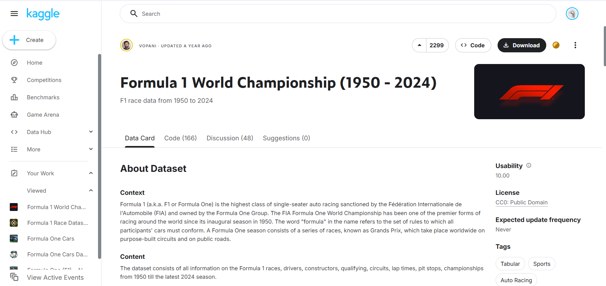
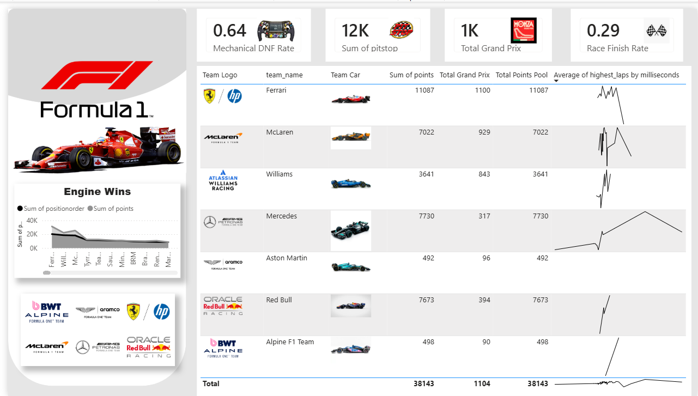

# 🏎️ Formula 1 Performance Analytics & Operational Risk Dashboard

An end-to-end Data Engineering and Business Intelligence pipeline that transforms raw historical Formula 1 race logs into strategic, executive-ready operational insights. This project bridges technical execution with data strategy by evaluating constructor performance metrics and asset reliability patterns.

---

## 📊 Project Architecture Overview
[ Kaggle API ] ──> [ Google Colab (Python) ] ──> [ Feature Engineering ] ──> [ Power BI Dashboard ]

### 1. Data Ingestion & Source
The workflow targets the **Formula 1 World Championship (1950 - 2024)** ecosystem dataset hosted on Kaggle, extracting deep records tracking race configurations, constructor profiles, circuit points, and historical reliability statuses.

### 2. ETL & Feature Engineering Pipeline (`f1.ipynb`)
Using **Python**, **Pandas**, and **Numpy** inside Google Colab, raw data tables (`results.csv`, `constructors.csv`, `races.csv`, `status.csv`, and `pit_stops.csv`) were dynamically compiled, filtered, and aggregated:
*   **Driver & Constructor Win Tallying:** Created custom metrics calculating conditional wins (`positionOrder == 1`) groupable by unique identification keys.
*   **Data Harmonization:** Isolated structural chronologies spanning from the 2008 season onwards, outputting a curated table containing engine profiles, exact lap milliseconds, and historical grid point values.

---

## 📈 Power BI Interactive Executive Layout & Demonstration

The refined `custom_f1_master_dataset.csv` pipeline maps clean analytics into an interactive business intelligence environment built for performance tracking.

### Dashboard Interface Snapshot

### 🎬 Interactive Dashboard Demonstration Video
Click the play video player below to watch the interactive features, filtering, and responsive metrics in action:

https://github.com/user-attachments/assets/dashboard.mp4

> *Note: If the embedded player above doesn't load automatically in your markdown viewer, you can view the video file directly [here](dashboard.mp4).*

### ⚙️ Operational KPIs Modeled:
*   **Mechanical DNF Rate (0.64):** Evaluates asset depreciation, failures, and manufacturing/engineering downtime patterns across competing eras.
*   **Sum of Pitstops (12K):** Aggregates logistical activities to look into multi-variable operational workloads.
*   **Total Grand Prix Count (1K+):** Serves as the operational volume benchmark database baseline.
*   **Race Finish Rate (0.29):** Tracks high-efficiency strategic execution metrics.
*   **Historical Trends Analysis:** Plots constructor trajectories, team win breakdowns, and average fastest-lap deviations dynamically down to the exact millisecond.

---

## 🛠️ Tech Stack Employed
*   **Data Manipulation:** Python 3, Pandas, Numpy, Kagglehub API
*   **Development Platform:** Google Colab / Jupyter Ecosystem
*   **BI & Data Visualization:** Power BI Desktop (`.pbix` engine)
